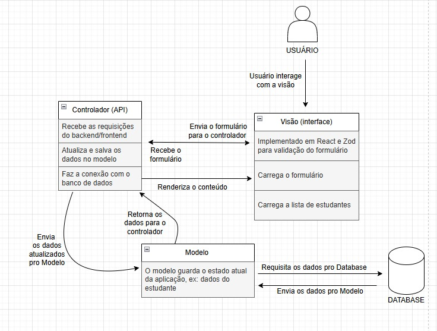
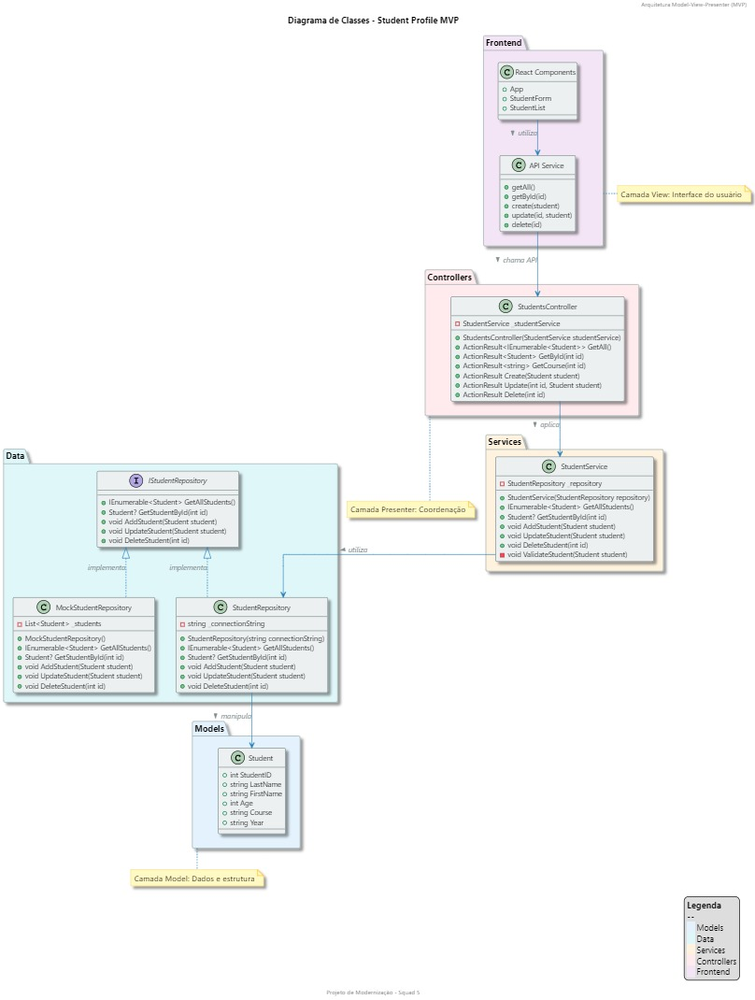

# Squad5


## 📋 Sobre o Projeto

Este projeto tem como objetivo modernizar um sistema legado de gerenciamento de estudantes, originalmente desenvolvido em VB6, migrando-o para .NET Core 9.0 com frontend em React.js. A arquitetura adotada segue o padrão **Model-View-Presenter (MVP)**, proporcionando uma separação clara de responsabilidades e facilitando a manutenção.

### Principais Funcionalidades

- ✅ **Migração de Banco de Dados**: Conversão de Access para SQLite
- ✅ **Interface Gráfica Moderna**: Frontend em React.js com design responsivo
- ✅ **Tradução Completa**: Interface traduzida do inglês para o português
- ✅ **CRUD de Estudantes**: Operações completas de gerenciamento
- ✅ **Validação de Dados**: Regras de negócio implementadas no backend e frontend
- ✅ **Documentação**: Diagramas de arquitetura e classes, e documentação técnica

## 🏗️ Arquitetura

O projeto segue o padrão arquitetural **MVP (Model-View-Presenter)**, que separa as responsabilidades em três camadas distintas:

### Model (Modelo)
- **Localização**: `Models/`
- **Responsabilidade**: Representa os dados e a lógica de negócio
- **Arquivos**: `Student.cs`

### View (Visão)
- **Localização**: `Views/`
- **Responsabilidade**: Interface do usuário (React Frontend)
- **Arquivos**: Componentes React para exibição e interação

### Presenter (Apresentador)
- **Localização**: `Presenters/`
- **Responsabilidade**: Mediação entre Model e View, lógica de apresentação
- **Arquivos**: `StudentsController.cs`, `StudentService.cs`

## 🛠️ Tecnologias Utilizadas

### Backend
- **ASP.NET Core 9.0** - Framework web
- **SQLite** - Banco de dados
- **Entity Framework Core** - ORM
- **Swagger/OpenAPI** - Documentação da API

### Frontend
- **React 18** - Biblioteca JavaScript
- **Styled Components** - CSS-in-JS
- **Axios** - Cliente HTTP para API calls
- **React Hook Form** - Gerenciamento de formulários
- **Zod** - Validação de dados

### Migração de Dados
- **Python** - Scripts de migração
- **pyodbc** - Conexão com banco Access
- **sqlite3** - Conexão com SQLite

## 📁 Estrutura do Projeto

```
StudentProfileMVP/
├── Models/                     # Modelos de Dados
│   └── Student.cs              # Modelo de estudante
├── Views/                      # Frontend React
│   ├── src/
│   │   ├── App.js              # Componente principal
│   │   ├── components/         # Componentes React
│   │   │   ├── StudentForm.js  # Formulário de estudantes
│   │   │   └── StudentList.js  # Lista de estudantes
│   │   └── services/
│   │       └── api.js          # Serviços de API
│   ├── package.json            # Dependências do frontend
│   └── public/                 # Arquivos estáticos
├── Presenters/                 # Camada de Apresentação
│   ├── StudentsController.cs   # API Controller
│   └── StudentService.cs       # Serviços de negócio
├── Data/                       # Camada de Dados
│   ├── StudentRepository.cs    # Repositório principal
│   └── MockStudentRepository.cs # Repositório mock
├── Database/                   # Banco de Dados
│   ├── students_cleaned.db     # SQLite Database
│   ├── AccessOriginal/         # Banco original
│   │   └── Sample.mdb          # Arquivo Access original
│   └── Migrator/               # Scripts de migração
│       ├── migration_script.py # Script principal
│       ├── cleaning_rules.py   # Regras de limpeza
│       └── config.py           # Configurações
├── Program.cs                  # Configuração da aplicação
├── appsettings.json            # Configurações
├── start-dev.bat               # Script de desenvolvimento
└── StudentProfile.NET.csproj   # Projeto .NET
```

## ⚙️ Configuração e Execução

### Pré-requisitos
- .NET 9.0 SDK
- Node.js 16+
- npm ou yarn
- Python 3.8+ (para scripts de migração)

### 1. Instalação das Dependências

```bash
# Instalar dependências do backend (.NET)
dotnet restore

# Instalar dependências do frontend (React)
cd Views
npm install
cd ..

# Instalar dependências Python (para migração)
cd Database/Migrator
pip install -r requirements.txt
cd ../..
```

### 2. Migração do Banco de Dados

```bash
# Executar script de migração (Python)
cd Database/Migrator
python -m migration_script
cd ../..
```

### 3. Executar a Aplicação

#### Opção A: Script Automático (Recomendado)
```bash
# Windows
start-dev.bat
```

#### Opção B: Manual
```bash
# Terminal 1 - Backend
dotnet run

# Terminal 2 - Frontend
cd Views
npm start
```

### 4. Acessar a Aplicação

- **Frontend**: http://localhost:3000
- **Backend API**: http://localhost:5000
- **Swagger/OpenAPI**: http://localhost:5000/swagger

## 📊 Diagrama de Arquitetura




## 📑 Diagrama de Arquitetura




## 🔄 Fluxo de Dados

1. **Frontend (React)** envia requisições HTTP para o backend
2. **Controller (Presenter)** recebe as requisições e coordena as ações
3. **Service (Presenter)** implementa a lógica de negócio e validações
4. **Repository (Model)** acessa o banco de dados SQLite
5. Os dados são retornados através da mesma cadeia até o frontend

## 🧪 Validações Implementadas

### Backend
- Validação de campos obrigatórios
- Validação de faixa etária (16-70 anos)
- Validação de formato de ano escolar
- Validação de tamanho máximo de campos

### Frontend
- Validação em tempo real com React Hook Form e Zod
- Feedback visual de erros
- Prevenção de envio de dados inválidos

## 🔍 Processo de Migração

O processo de migração do banco de dados Access para SQLite incluiu:

1. **Extração**: Leitura dos dados do banco Access usando pyodbc
2. **Transformação**: Limpeza e padronização dos dados
   - Correção de formatos de nome
   - Padronização de cursos
   - Validação de idades
   - Normalização de anos escolares
3. **Carga**: Inserção dos dados limpos no banco SQLite

## 📈 Melhorias em Relação ao Sistema Original

- **Performance**: Sistema mais rápido e responsivo
- **Manutenibilidade**: Código moderno e bem estruturado
- **Usabilidade**: Interface intuitiva e responsiva
- **Escalabilidade**: Arquitetura preparada para crescimento
- **Portabilidade**: Funciona em múltiplas plataformas

---

Desenvolvido pelo Squad 5 ❤️ como parte do projeto de modernização de sistemas legados.

## 🤝 Contribuição

Para contribuir com o projeto, siga o fluxo abaixo:

1. **Criação de Issues:** Antes de iniciar qualquer desenvolvimento, crie uma *issue* detalhando o problema ou a funcionalidade desejada. Isso permite o acompanhamento e discussão da demanda pela equipe.
2. **Desenvolvimento:** Crie uma branch a partir da `main` vinculada à issue criada.
3. **Pull Request (PR):** Após finalizar o desenvolvimento, abra uma *Pull Request* (PR) e associe-a à issue correspondente.
4. **Revisão:** Cada PR deve ser revisada e aprovada por pelo menos **2 revisores** antes de ser mesclada à branch `main`.

Dessa forma, garantimos rastreabilidade, qualidade e colaboração no desenvolvimento do projeto.
